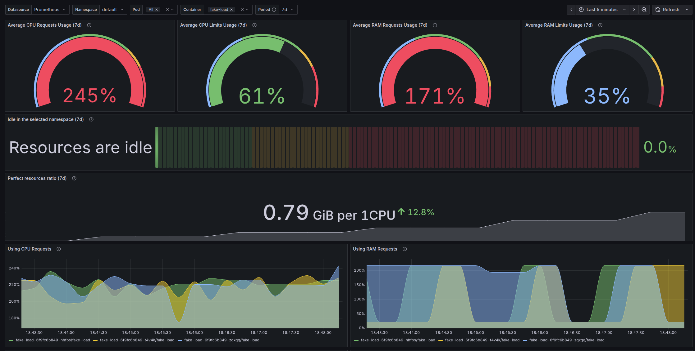
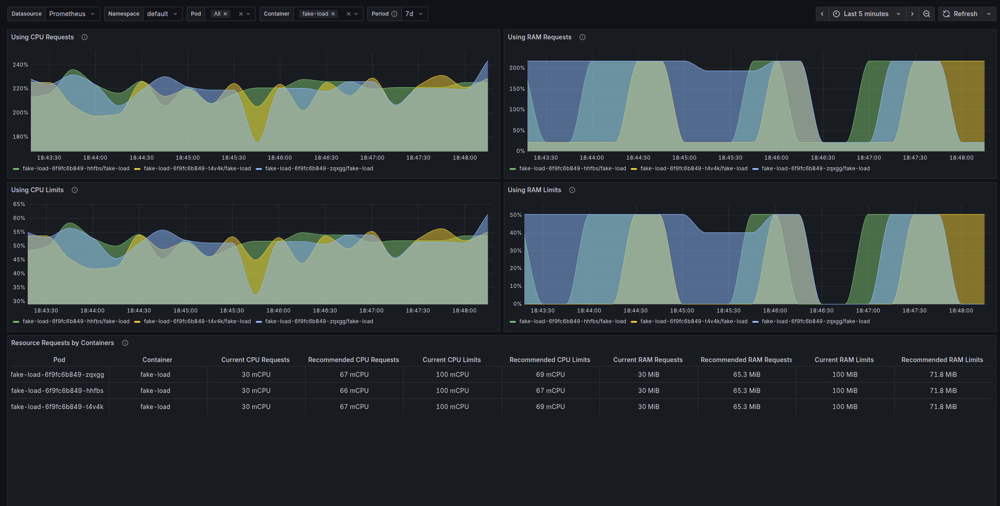

# Resource Efficiency Dashboard

---

## Project Description

Resource Efficiency Dashboard is a Grafana dashboard designed to monitor resource utilization efficiency in Kubernetes
clusters. The dashboard visualizes the relationship between requested and actually used resources (CPU and RAM) for
containers, which allows optimizing resource allocation and reducing infrastructure costs.

### Preview






### What the Dashboard Shows

The dashboard provides the following information:

- **Resource Requests Usage**: Shows how efficiently the requested CPU and RAM resources are being used (in percentages).
- **Resource Limits Usage**: Displays how close containers are to their established limits.
- **Average Resource Idle Percentage**: Visualizes unused resources in the selected namespace.
- **Optimal Resource Ratio**: Calculates the ideal RAM to CPU ratio based on data for the selected time range.
- **Resource Usage Graphs**: Show resource usage dynamics over time.
- **Recommendations Table**: Compares current requests and limits with recommended values based on historical data.

### Why This Information is Important for Kubernetes Users

This dashboard helps DevOps engineers and Kubernetes cluster administrators to:

1. **Optimize Costs**: Identify containers with excessive resource requests, which helps reduce infrastructure expenses.
2. **Improve Stability**: Detect containers with insufficient resources that may cause performance issues.
3. **Enhance Placement Density**: Optimize pod placement on cluster nodes.
4. **Plan Scaling**: Obtain data for making decisions about cluster scaling needs.
5. **Identify Anomalies**: Detect unusual resource usage patterns that may indicate problems in applications.

### Importance of Setting Correct Resources for Containers

Setting correct resources (requests and limits) for containers in Kubernetes is critically important for several reasons:

- **Effective Scheduling**: The Kubernetes Scheduler uses request values to make decisions about pod placement on nodes.
  Incorrect values can lead to suboptimal load distribution.
- **Preventing Resource Contention**: Proper limits prevent situations where one container consumes all available node
  resources, affecting the operation of other containers.
- **Resource Conservation**: Excessive requests lead to inefficient cluster utilization and increased costs.
- **Operational Stability**: Insufficient requests and limits can lead to unstable application performance, OOMKills,
  and performance degradation.
- **Predictability**: Correct resource values make system behavior more predictable and simplify autoscaling.

This dashboard provides the necessary metrics for making informed decisions when configuring container resources,
contributing to more efficient use of the Kubernetes cluster and reducing operational costs.

## How to Use the Dashboard

1. Select the desired namespace from the dropdown list.
2. If necessary, refine the selection by specifying specific pods and/or containers.
3. Analyze resource usage metrics for the selected period.
4. Pay attention to the recommended resource values in the table at the bottom of the dashboard.
5. Use the obtained information to adjust requests and limits in Kubernetes manifests.

### Not a bug — a feature!

When monitoring CPU consumption by containers in a Kubernetes cluster, there is an important nuance: the metric
container_cpu_usage_seconds_total is a counter that shows how much CPU time a container has used.
Because metrics are scraped at discrete intervals (typically every 30–60 seconds) and this counter is used with
rate/irate, the resulting CPU usage graph is heavily smoothed. This means we have no visibility into short CPU spikes —
the metric simply does not reflect them. Therefore, choosing optimal CPU limits can be tricky.

In the following cases we cannot draw reliable conclusions about CPU limits:

- the container uses less CPU than the configured limit and does not experience throttling;
- the process is throttled for a significant portion of its runtime (>40%).

So for the first case, rely on average CPU usage. For the second case, you should substantially increase the limit.

To address this, the following formula was used:

$$
y(x) = L_1 \bigl(1 - e^{-k_1 x}\bigr) + L_2 \bigl(1 - e^{-k_2 x}\bigr), \qquad L_1 + L_2 = L
$$

where:

- $ x $ — the throttling value;
- $ L $ — the asymptotic value of the function ($ x \to \infty $);
- $ L_1 $, $ L_2 $ — the shares of total saturation responsible for the fast and slow components;
- $ k_1 $, $ k_2 $ — the rate coefficients (the larger $ k $, the faster the growth).

The function models a process with two saturation stages: fast and slow. The first exponent provides a sharp start,
while the second delivers a smooth approach to full saturation ($ L $).

A fast start is needed when throttling is present in the selected interval. That means estimating the limit by average
consumption is incorrect, and the existing limit should be increased.

As a result, the dashboard uses a special approach to determining the limit and includes two additional panels.

**Practical recommendations**

When setting CPU limits for your containers, always check the throttling panel. If you don’t see throttling on the
chart, be aware that the recommended value may be underestimated. If you see a very high throttling percentage, the
value is ambiguous. In both cases, you will likely need to adjust the values again to arrive at a more accurate limit.

Finding the smallest CPU limit at which throttling tends toward zero is the ideal scenario.

Also keep in mind that much depends on your application inside the container and its workload profile.

### Integration with Horizontal Pod Autoscaler (HPA)

If you use HPA, consider not only the dashboard’s recommendations but also the HPA scaling thresholds. Below are a few tips on how to use them together.

With target = 70%, HPA tends to drive average usage to ≈ 0.7 × requests per replica. Therefore:

  - If you set requests too low, the utilization metric will be inflated and HPA will overinflate the replica count.
  - If you set requests too high, utilization will drop — you’ll get fewer replicas and “fat” pods.

First, calibrate requests using the dashboard’s metrics (stable average and quantile peaks), then set the target (typically 60–75% for CPU, 60–80% for memory) and validate HPA’s behavior.

  - If you see frequent up-scales without actual overload, increase the container’s requests or the HPA target.
  - If CPU throttling is high, increase the CPU limit (and requests if sustained real peaks are present).
  - If you observe OOM/pressure, increase memory requests/limits, or lower the target for memory.

Revisit the values after several days with different load profiles (weekdays/weekends).

---

## How to prepare the local development environment

To prepare the development environment, you can use the following commands on your kubernetes cluster. I recommend using
minikube.

Install Prometheus:

```bash
helm upgrade --install --create-namespace prometheus prometheus-community/prometheus \
  --namespace monitoring \
  --set alertmanager.enabled=false \
  --set pushgateway.enabled=false \
  --set nodeExporter.enabled=true \
  --set kubeStateMetrics.enabled=true \
  --set server.service.type=NodePort \
  --set server.service.nodePort=30090 \
  --set server.global.scrape_interval="30s" \
  --set 'server.metricRelabelings[0].action=replace' \
  --set 'server.metricRelabelings[0].target_label=cluster' \
  --set 'server.metricRelabelings[0].replacement=minikube'
```

Install Grafana:

```bash
helm upgrade --install grafana grafana/grafana --create-namespace \
  --namespace monitoring \
  --set service.type=NodePort \
  --set service.nodePort=30300 \
  --set adminPassword='admin' \
  --set="datasources.datasources\.yaml.apiVersion=1" \
  --set="datasources.datasources\.yaml.datasources[0].name=Prometheus" \
  --set="datasources.datasources\.yaml.datasources[0].type=prometheus" \
  --set="datasources.datasources\.yaml.datasources[0].url=http://prometheus-server.monitoring.svc.cluster.local" \
  --set="datasources.datasources\.yaml.datasources[0].access=proxy" \
  --set="datasources.datasources\.yaml.datasources[0].isDefault=true"
```

After that, you can import the dashboard from the `dashboard.json` file. To do this, go to the Grafana dashboard at
`http://<your-minikube-ip>:30300` and log in with the password `admin`. Then open the `Configuration` tab in the left menu and
click the `+` button in the upper right corner. Select `Import` and upload the `dashboard.json` file.

Now you can add a test workload to your cluster to get some metrics. For example, you can use the following command:

```bash
kubectl apply -f - <<EOF
apiVersion: apps/v1
kind: Deployment
metadata:
  name: fake-load
spec:
  replicas: 3
  selector:
    matchLabels:
      app: fake-load
  template:
    metadata:
      labels:
        app: fake-load
    spec:
      containers:
        - name: fake-load
          image: alpine:3.20
          imagePullPolicy: IfNotPresent
          command: ["/bin/sh", "-c"]
          args:
            - |
              set -eu
              apk add --no-cache stress-ng >/dev/null
              echo "Starting ~40m CPU and 40Mi memory load"
              while true; do
                stress-ng --cpu 1 --cpu-load 4 --vm 1 --vm-bytes 40M --vm-keep --timeout 60s
                echo "Pause 30s"
                sleep 30
              done
          resources:
            requests:
              cpu: "30m"
              memory: "30Mi"
            limits:
              cpu: "100m"
              memory: "100Mi"
EOF
```

Your development environment is ready! New metrics will be available in the dashboard after a few minutes.